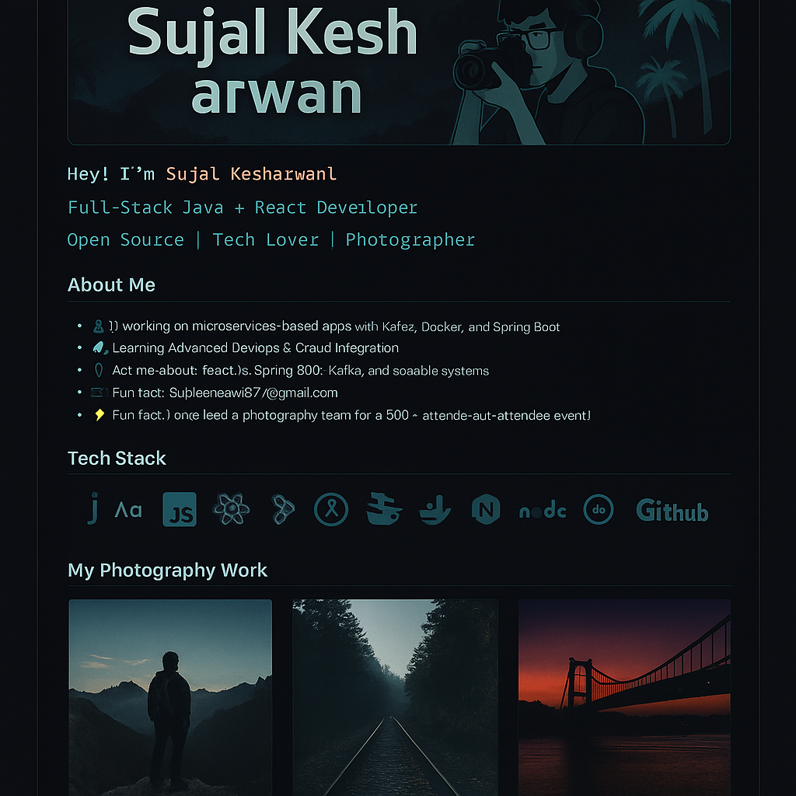

  

<h1 align="center">Hi 👋, I'm Sujal Kesharwani</h1>
<h3 align="center">B.Tech IT student | Full-Stack Developer | Tech Explorer | Photography Enthusiast 📸</h3>

  

- 🔭 I’m currently working on **microservices-based apps with Kafka, Docker, and Spring Boot**
- 🌱 Currently learning **Advanced DevOps & Cloud Integration**
- 💬 Ask me about **React.js, Spring Boot, Kafka, and building scalable systems**
- 📸 I love **photography** – check out my [Instagram](https://www.instagram.com/sujal_kesharwani30/)
- 📫 Reach me at **sujalkesharwani677@gmail.com**
- ⚡ Fun fact: I once led a photography team for a 500+ attendee event!

---

## 🛠️ Tech Stack

---

## 📊 GitHub Stats

---

## 🏆 Trophies

---

## 🔍 Activity Graph

---

## 📚 Projects

- 🚀 **[Expense Tracker App](https://github.com/Sujal-k/ExpenseTrackerApp)** – Full microservices app with Kafka, Docker, and JWT auth
- 📍 **[GeoFence Ticket Validator](https://github.com/Sujal-k/GeoFence-Ticket-Validation-System)** – Real-time geolocation ticket validation system

---

## 🔗 Connect With Me

---

> _“Code is like photography – capture the moment, edit the bugs, frame the structure.”_ 📸💻
